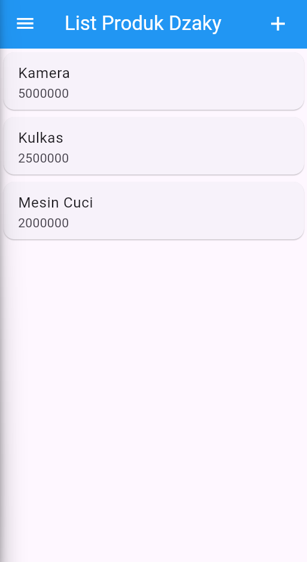
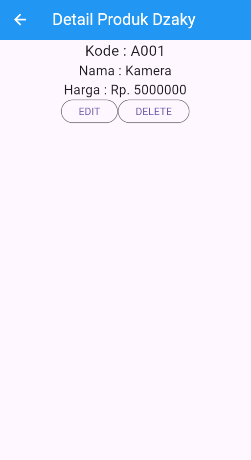
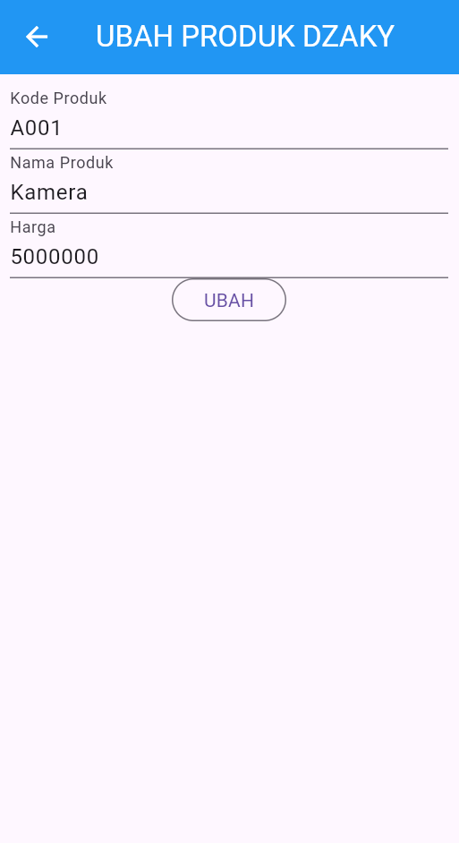
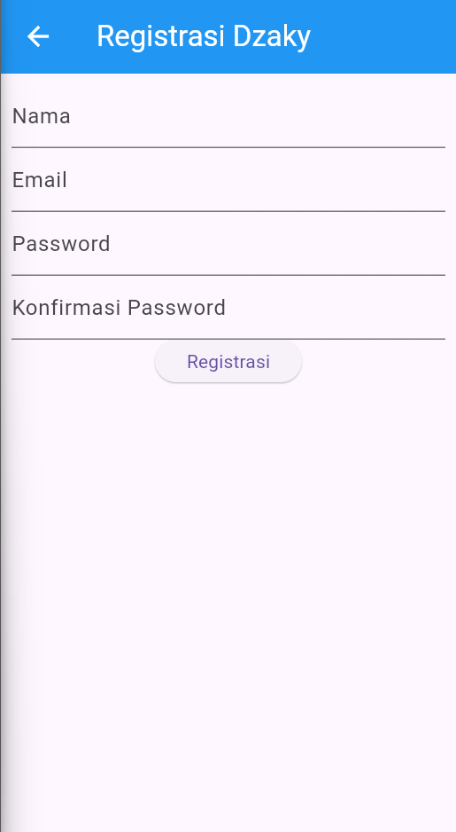

## Struktur Modul

### 1. Model
- **`produk.dart`**: Model data untuk produk dengan properti id, kodeProduk, namaProduk, dan hargaProduk

### 2. UI Pages
- **`login_page.dart`**: Halaman login dengan form email dan password
- **`registrasi_page.dart`**: Halaman registrasi dengan validasi lengkap
- **`produk_page.dart`**: Halaman daftar produk dengan drawer menu
- **`produk_form.dart`**: Form untuk menambah/edit produk
- **`produk_detail.dart`**: Halaman detail produk dengan tombol edit dan hapus

## Screenshots

### 1. Login Page

- AppBar biru dengan judul "Login" berwarna putih
- Form dengan TextFormField untuk email dan password
- Validasi input (email harus diisi, password tidak boleh kosong)
- Tombol "Login" dengan ElevatedButton
- Link "Registrasi" untuk navigasi ke halaman registrasi

### 2. Product List Page

- AppBar biru dengan hamburger menu dan tombol (+) berwarna putih
- ListView berisi Card untuk setiap produk
- Setiap item menampilkan nama produk dan harga
- Drawer dengan menu logout
- Floating action button (+) untuk menambah produk baru

### 3. Product Detail Page

- AppBar dengan tombol back berwarna putih
- Tampilan detail produk (kode, nama, harga)
- Dua tombol OutlinedButton: "EDIT" dan "DELETE"
- AlertDialog untuk konfirmasi hapus
- Layout menggunakan Column dengan Center alignment

### 4. Product Form Page

- AppBar dengan judul dinamis ("TAMBAH PRODUK" atau "UBAH PRODUK")
- Form dengan TextFormField untuk kode, nama, dan harga produk
- Validasi pada setiap field (tidak boleh kosong)
- Tombol submit dengan teks dinamis ("SIMPAN" atau "UBAH")
- SingleChildScrollView untuk scroll pada form panjang

### 5. Registration Page

- Form registrasi dengan field nama, email, password, dan konfirmasi password
- Validasi lengkap (nama min 3 karakter, email format valid, password min 6 karakter)
- Konfirmasi password harus sama dengan password
- Loading state management dengan _isLoading

## Komponen UI Utama
### Form Validation
Setiap TextFormField dilengkapi dengan validator:
- **Email**: Validasi format email dengan RegExp
- **Password**: Minimal 6 karakter
- **Nama**: Minimal 3 karakter
- **Required fields**: Tidak boleh kosong

### Navigation
Menggunakan Navigator.push dan Navigator.pushReplacement untuk navigasi antar halaman dengan MaterialPageRoute.

### State Management
- StatefulWidget untuk form dan interaksi
- TextEditingController untuk kontrol input
- GlobalKey<FormState> untuk validasi form