# Toko Kita - TUGAS 9 PERTEMUAN 11

## 📱 Screenshots UI & Proses Step-by-Step

### 1. Proses Login

#### a. Form Login & Input Data


**Proses:**
- User membuka aplikasi dan melihat form login
- User menginputkan email dan password yang telah terdaftar

**Kode Form Login:**
```dart
Widget _emailTextField() {
  return TextFormField(
    decoration: const InputDecoration(labelText: "Email"),
    keyboardType: TextInputType.emailAddress,
    controller: _emailTextboxController,
    validator: (value) {
      if (value!.isEmpty) {
        return 'Email harus diisi';
      }
      return null;
    },
  );
}
```
**Penjelasan:**
Kode ini membuat form input untuk email dan password. TextFormField adalah widget yang bisa menerima input teks dari user dan juga bisa melakukan validasi. Controller digunakan untuk mengambil nilai yang diketik user, sedangkan validator adalah fungsi yang mengecek apakah input user sudah benar atau belum. Kalau email kosong, maka akan muncul pesan error. Untuk email, kita set keyboard type jadi emailAddress supaya user dapat keyboard yang khusus untuk email.

```dart
Widget _passwordTextField() {
  return TextFormField(
    decoration: const InputDecoration(labelText: "Password"),
    keyboardType: TextInputType.text,
    obscureText: true,
    controller: _passwordTextboxController,
    validator: (value) {
      if (value!.isEmpty) {
        return "Password harus diisi";
      }
      return null;
    },
  );
}
```
**Penjelasan:**
Untuk input password, kita set obscureText jadi true supaya teks yang diketik tidak terlihat (jadi bulatan-bulatan hitam). Validator di sini cuma ngecek apakah password sudah diisi atau masih kosong. Kalau masih kosong ya bakal muncul pesan error.

#### b. Validasi & Hasil Login

**Proses Login Berhasil:**
- Sistem memvalidasi email dan password dengan data tersimpan
- User diarahkan ke halaman List Produk

**Kode Proses Login:**
```dart
void _performLocalLogin() async {
  try {
    final userInfo = UserInfo();
    String? storedEmail = await userInfo.getEmail();
    String? storedPassword = await userInfo.getPassword();
    
    String inputEmail = _emailTextboxController.text;
    String inputPassword = _passwordTextboxController.text;
    
    if (storedEmail == inputEmail && storedPassword == inputPassword) {
      await userInfo.setToken("dummy_token");
      await userInfo.setUserID(1);
      
      Navigator.pushReplacement(
        context,
        MaterialPageRoute(builder: (context) => const ProdukPage()),
      );
    } else {
      // Login failed - show error dialog
    }
  } catch (error) {
    // Handle error
  }
}
```
**Penjelasan:**
Fungsi ini melakukan proses login secara lokal. Pertama kita ambil email dan password yang sudah disimpan sebelumnya dari SharedPreferences. Terus kita bandingkan dengan yang diketik user. Kalau sama, berarti login berhasil dan user dibawa ke halaman produk. Kalau beda, ya login gagal. Kita pakai async/await karena operasi SharedPreferences butuh waktu. Try-catch digunakan untuk menangkap error jika ada yang salah.

**Login Gagal:****
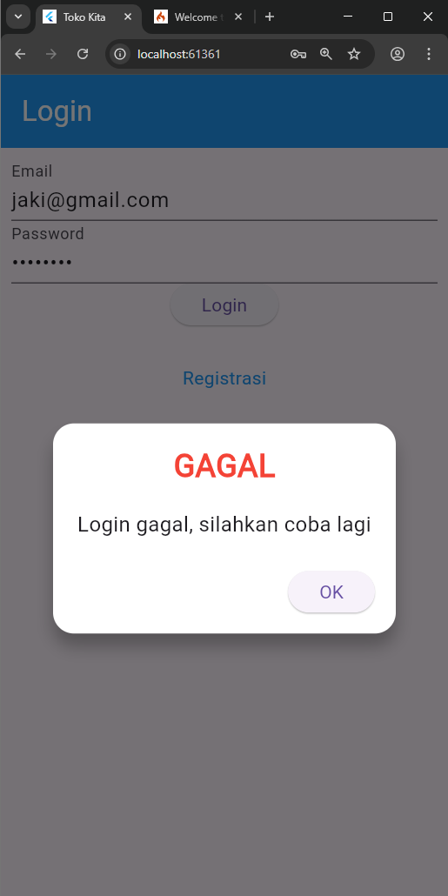

**Proses Login Gagal:**
- Sistem menampilkan dialog error "Login gagal, silahkan coba lagi"
- User dapat mencoba login kembali

**Kode Error Dialog:**
```dart
showDialog(
  context: context,
  barrierDismissible: false,
  builder: (BuildContext context) => const WarningDialog(
    description: "Login gagal, silahkan coba lagi",
  ),
);
```
**Penjelasan:**
Kode ini menampilkan popup dialog ketika login gagal. BarrierDismissible false artinya user gak bisa nutup dialog dengan tap di luar area dialog, jadi harus klik tombol OK. Builder adalah fungsi yang membuat widget dialog yang akan ditampilkan. Context diperlukan untuk tahu di mana dialog harus ditampilkan.

### 2. Proses Registrasi

#### a. Form Registrasi & Input Data
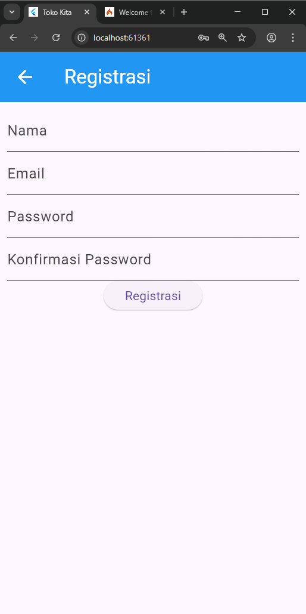
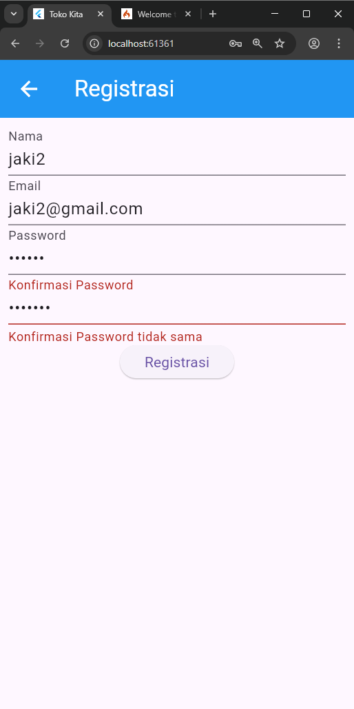

**Proses:**
- User mengklik link "Registrasi" dari halaman login
- User mengisi form dengan nama, email, password, dan konfirmasi password

**Kode Form Registrasi:**
```dart
Widget _namaTextField() {
  return TextFormField(
    decoration: const InputDecoration(labelText: "Nama"),
    keyboardType: TextInputType.text,
    controller: _namaTextboxController,
    validator: (value) {
      if (value!.length < 3) {
        return "Nama harus diisi minimal 3 karakter";
      }
      return null;
    },
  );
}
```
**Penjelasan:**
Form nama mengecek apakah nama yang diisi minimal 3 karakter. Kalau kurang dari 3 karakter, bakal muncul pesan error. Controller digunakan untuk mengambil dan mengatur nilai yang diketik user.

```dart
Widget _passwordKonfirmasiTextField() {
  return TextFormField(
    decoration: const InputDecoration(labelText: "Konfirmasi Password"),
    keyboardType: TextInputType.text,
    obscureText: true,
    validator: (value) {
      if (value != _passwordTextboxController.text) {
        return "Konfirmasi Password tidak sama";
      }
      return null;
    },
  );
}
```
**Penjelasan:**
Form konfirmasi password ini mengecek apakah password yang diketik sama dengan password sebelumnya. Kita bandingkan nilai input konfirmasi dengan controller password yang pertama. Kalau beda, bakal muncul error. Form ini tidak pakai controller sendiri karena cuma buat validasi aja.

#### b. Hasil Registrasi

**Registrasi Berhasil:**
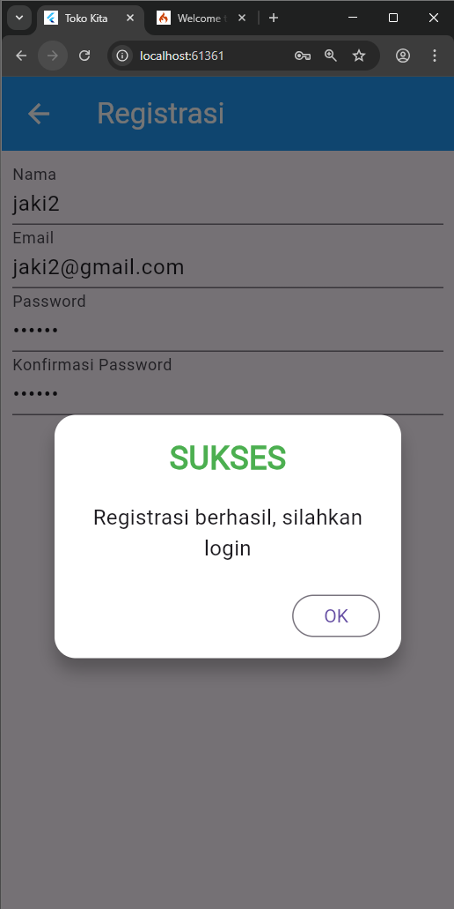

**Proses:**
- Sistem menyimpan kredensial user secara lokal
- Menampilkan dialog sukses dengan pesan "Registrasi berhasil, silahkan login"

**Kode Proses Registrasi:**
```dart
void _performLocalRegistration() async {
  try {
    final userInfo = UserInfo();
    await userInfo.setEmail(_emailTextboxController.text);
    await userInfo.setPassword(_passwordTextboxController.text);
    
    showDialog(
      context: context,
      barrierDismissible: false,
      builder: (BuildContext context) => SuccessDialog(
        description: "Registrasi berhasil, silahkan login",
        okClick: () {
          Navigator.pop(context);
        },
      ),
    );
  } catch (error) {
    // Handle registration error
  }
}
```
**Penjelasan:**
Proses registrasi ini menyimpan email dan password user ke dalam storage lokal HP menggunakan SharedPreferences. Kalau berhasil disimpan, akan muncul dialog sukses yang bilang registrasi berhasil. User bisa klik OK untuk nutup dialog dan balik ke halaman login. Kalau ada error, akan ditangkap di bagian catch.

### 3. Halaman List Produk

#### a. Tampilan Daftar Produk
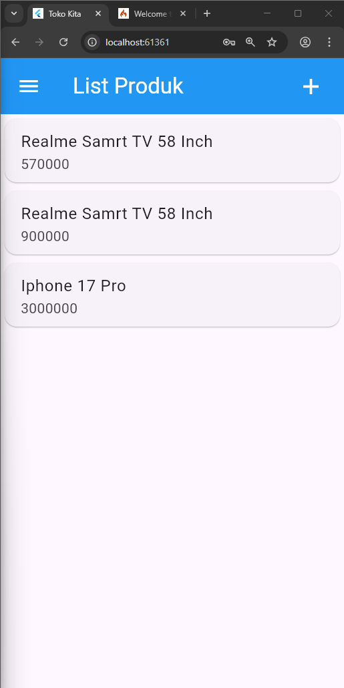

**Fitur:**
- AppBar biru dengan hamburger menu dan tombol tambah (+)
- Daftar produk dalam bentuk Card
- Drawer menu dengan opsi logout

**Kode List Produk:**
```dart
body: FutureBuilder<List>(
  future: ProdukBloc.getProduks(),
  builder: (context, snapshot) {
    if (snapshot.hasError) print(snapshot.error);
    return snapshot.hasData
        ? ListProduk(list: snapshot.data)
        : const Center(child: CircularProgressIndicator());
  },
)
```
**Penjelasan:**
FutureBuilder adalah widget yang bagus untuk menampilkan data yang butuh waktu untuk dimuat, seperti data dari internet atau database. Sementara data belum ready, akan muncul loading spinner. Kalau data sudah siap, baru ditampilkan listnya. Kalau ada error, akan di-print ke console.

```dart
class ItemProduk extends StatelessWidget {
  final Produk produk;
  const ItemProduk({Key? key, required this.produk}) : super(key: key);

  @override
  Widget build(BuildContext context) {
    return GestureDetector(
      onTap: () {
        Navigator.push(
          context,
          MaterialPageRoute(builder: (context) => ProdukDetail(produk: produk)),
        );
      },
      child: Card(
        child: ListTile(
          title: Text(produk.namaProduk!),
          subtitle: Text(produk.hargaProduk.toString()),
        ),
      ),
    );
  }
}
```
**Penjelasan:**
ItemProduk adalah widget untuk menampilkan satu item produk dalam bentuk card. GestureDetector digunakan untuk mendeteksi ketika user tap/sentuh item tersebut. Ketika di-tap, user akan dibawa ke halaman detail produk. Card memberikan tampilan yang lebih bagus dengan shadow dan rounded corners. ListTile adalah widget standar yang biasa dipakai untuk list item.

### 4. Proses Tambah Data Produk

#### a. Form Tambah Produk
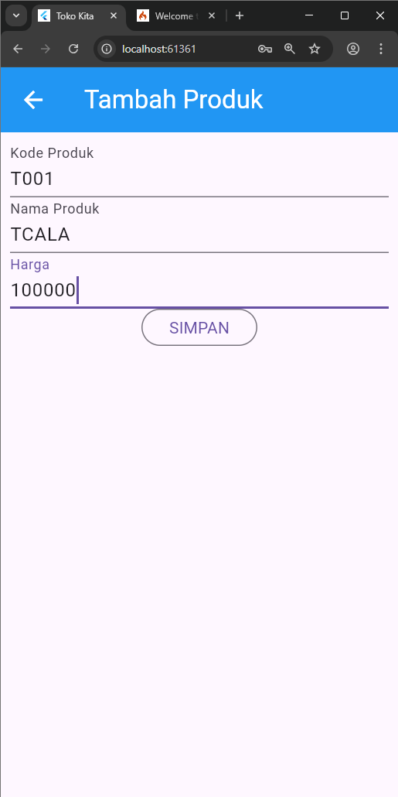

**Proses:**
- User mengklik tombol (+) di AppBar
- Sistem menampilkan form "TAMBAH PRODUK"
- User mengisi kode produk, nama produk, dan harga

**Kode Form Tambah:**
```dart
Widget _kodeProdukTextField() {
  return TextFormField(
    decoration: const InputDecoration(labelText: "Kode Produk"),
    keyboardType: TextInputType.text,
    controller: _kodeProdukTextboxController,
    validator: (value) {
      if (value!.isEmpty) {
        return "Kode Produk harus diisi";
      }
      return null;
    },
  );
}
```
**Penjelasan:**
Form kode produk ini cuma ngecek apakah sudah diisi atau belum. Kalau masih kosong, muncul error. Controller digunakan untuk mengambil dan mengatur nilai yang diketik user.

```dart
Widget _buttonSubmit() {
  return OutlinedButton(
    child: Text(tombolSubmit),
    onPressed: () {
      var validate = _formKey.currentState!.validate();
      if (validate) {
        if (!_isLoading) {
          if (widget.produk != null) {
            ubah(); // Update product
          } else {
            simpan(); // Create new product
          }
        }
      }
    },
  );
}
```
**Penjelasan:**
Tombol submit ini pertama ngecek apakah semua form sudah valid. Kalau valid dan tidak sedang loading, baru diproses. Kode ini pintar karena bisa bedain antara mode tambah produk baru atau edit produk yang sudah ada. Kalau widget.produk tidak null artinya mode edit, kalau null artinya mode tambah.

#### b. Proses Simpan Data

**Simpan Berhasil:**
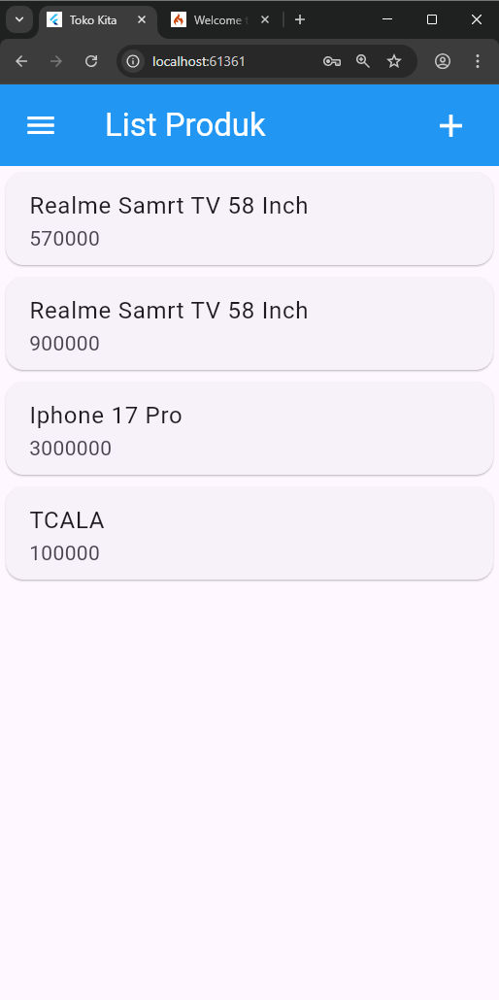

**Proses:**
- Sistem memvalidasi input form
- Data produk baru disimpan
- User diarahkan kembali ke halaman list produk

**Kode Simpan Data:**
```dart
simpan() {
  setState(() {
    _isLoading = true;
  });
  Produk createProduk = Produk(id: null);
  createProduk.kodeProduk = _kodeProdukTextboxController.text;
  createProduk.namaProduk = _namaProdukTextboxController.text;
  createProduk.hargaProduk = int.parse(_hargaProdukTextboxController.text);
  
  ProdukBloc.addProduk(produk: createProduk).then(
    (value) {
      Navigator.of(context).push(
        MaterialPageRoute(builder: (BuildContext context) => const ProdukPage()),
      );
    },
    onError: (error) {
      showDialog(
        context: context,
        builder: (BuildContext context) => const WarningDialog(
          description: "Simpan gagal, silahkan coba lagi",
        ),
      );
    },
  );
  setState(() {
    _isLoading = false;
  });
}
```
**Penjelasan:**
Fungsi simpan ini pertama set loading jadi true biar user tau lagi proses. Terus bikin object Produk baru dengan data dari form. Harga harus di-parse jadi integer karena input dari form itu string. Setelah itu panggil ProdukBloc untuk nyimpen data. Kalau berhasil, user dibawa balik ke halaman list. Kalau gagal, muncul dialog error. Loading di-set false lagi setelah selesai.

### 5. Proses Lihat Detail Produk

#### a. Halaman Detail Produk
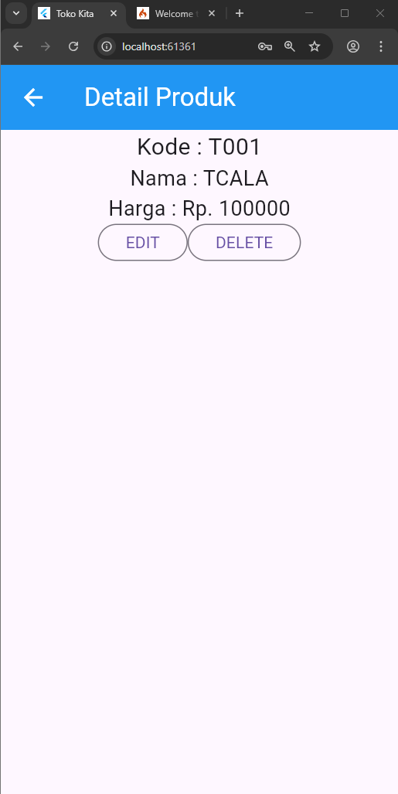

**Proses:**
- User mengklik salah satu item produk dari list
- Sistem menampilkan detail produk (kode, nama, harga)
- Tersedia tombol EDIT dan DELETE

**Kode Detail Produk:**
```dart
body: Center(
  child: Column(
    children: [
      Text(
        "Kode : ${widget.produk!.kodeProduk}",
        style: const TextStyle(fontSize: 20.0),
      ),
      Text(
        "Nama : ${widget.produk!.namaProduk}",
        style: const TextStyle(fontSize: 18.0),
      ),
      Text(
        "Harga : Rp. ${widget.produk!.hargaProduk.toString()}",
        style: const TextStyle(fontSize: 18.0),
      ),
      _tombolHapusEdit(),
    ],
  ),
)
```
**Penjelasan:**
Kode ini menampilkan detail produk yang dikirim dari halaman sebelumnya. Widget.produk adalah data yang diterima dari halaman list. String interpolation dengan ${} digunakan untuk menampilkan data yang dinamis di dalam text. Layout menggunakan Center dan Column biar data ditampilkan secara vertikal di tengah layar. Tombol Edit dan Delete ada di bagian bawah.

### 6. Proses Edit Data Produk

#### a. Form Edit Produk
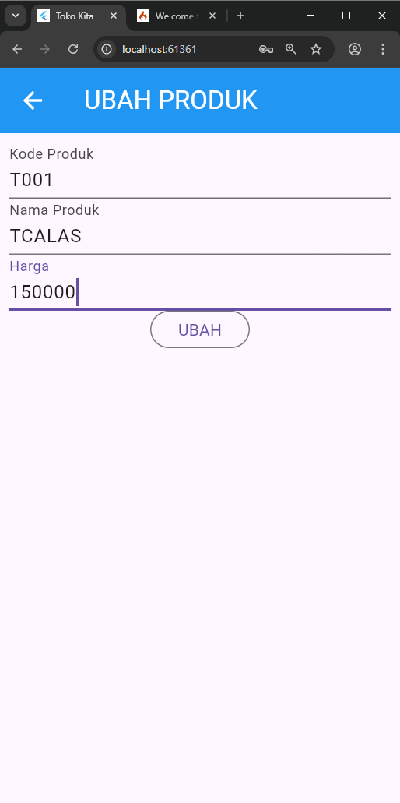

**Proses:**
- User mengklik tombol "EDIT" dari detail produk
- Form ditampilkan dengan data yang sudah terisi
- Judul berubah menjadi "UBAH PRODUK"

**Kode Inisialisasi Edit:**
```dart
isUpdate() {
  if (widget.produk != null) {
    setState(() {
      judul = "UBAH PRODUK";
      tombolSubmit = "UBAH";
      _kodeProdukTextboxController.text = widget.produk!.kodeProduk!;
      _namaProdukTextboxController.text = widget.produk!.namaProduk!;
      _hargaProdukTextboxController.text = widget.produk!.hargaProduk.toString();
    });
  } else {
    judul = "TAMBAH PRODUK";
    tombolSubmit = "SIMPAN";
  }
}
```
**Penjelasan:**
Fungsi ini ngecek apakah form sedang dalam mode edit atau tambah. Kalau ada data produk berarti mode edit, jadi form diisi dengan data yang sudah ada dan judul diganti jadi "UBAH PRODUK". Kalau tidak ada data produk berarti mode tambah, jadi form kosong dan judul "TAMBAH PRODUK". Controller text diisi dengan data existing supaya user bisa edit.

#### b. Proses Update Data

**Update Berhasil:**
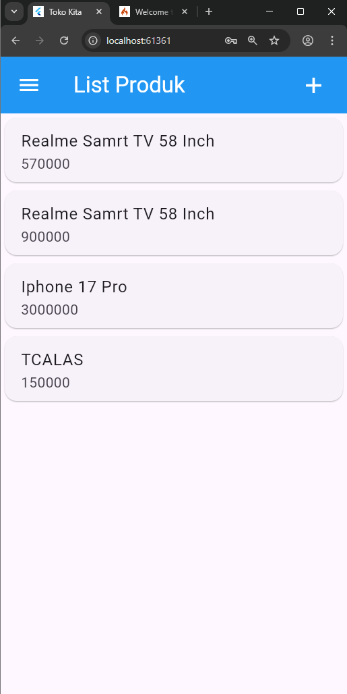

**Kode Update Data:**
```dart
ubah() {
  setState(() {
    _isLoading = true;
  });
  Produk updateProduk = Produk(id: widget.produk!.id!);
  updateProduk.kodeProduk = _kodeProdukTextboxController.text;
  updateProduk.namaProduk = _namaProdukTextboxController.text;
  updateProduk.hargaProduk = int.parse(_hargaProdukTextboxController.text);
  
  ProdukBloc.updateProduk(produk: updateProduk).then(
    (value) {
      Navigator.of(context).push(
        MaterialPageRoute(builder: (BuildContext context) => const ProdukPage()),
      );
    },
    onError: (error) {
      showDialog(
        context: context,
        builder: (BuildContext context) => const WarningDialog(
          description: "Permintaan ubah data gagal, silahkan coba lagi",
        ),
      );
    },
  );
  setState(() {
    _isLoading = false;
  });
}
```
**Penjelasan:**
Fungsi ubah ini mirip dengan fungsi simpan, bedanya kita bikin object Produk dengan ID yang sama seperti data aslinya. Ini penting biar sistem tau produk mana yang mau diupdate. ProdukBloc.updateProduk dipanggil untuk proses update. Kalau berhasil user dibawa balik ke list, kalau gagal muncul dialog error. Pattern loading sama seperti fungsi simpan.

### 7. Proses Hapus Data Produk

#### a. Konfirmasi Hapus
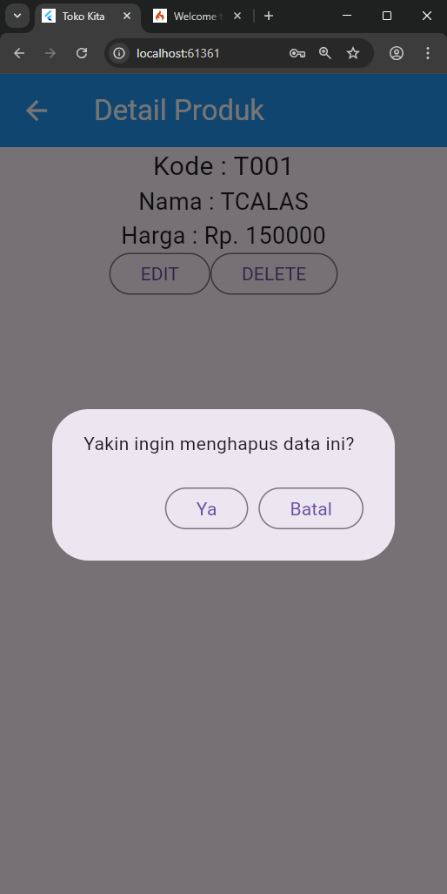

**Proses:**
- User mengklik tombol "DELETE" dari detail produk
- Sistem menampilkan dialog konfirmasi
- User memilih "Ya" atau "Batal"

**Kode Konfirmasi Hapus:**
```dart
void confirmHapus() {
  AlertDialog alertDialog = AlertDialog(
    content: const Text("Yakin ingin menghapus data ini?"),
    actions: [
      OutlinedButton(
        child: const Text("Ya"),
        onPressed: () {
          ProdukBloc.deleteProduk(id: int.parse(widget.produk!.id!)).then(
            (value) => {
              Navigator.of(context).push(
                MaterialPageRoute(builder: (context) => const ProdukPage()),
              ),
            },
            onError: (error) {
              showDialog(
                context: context,
                builder: (BuildContext context) => const WarningDialog(
                  description: "Hapus gagal, silahkan coba lagi",
                ),
              );
            },
          );
        },
      ),
      OutlinedButton(
        child: const Text("Batal"),
        onPressed: () => Navigator.pop(context),
      ),
    ],
  );
  showDialog(builder: (context) => alertDialog, context: context);
}
```
**Penjelasan:**
Dialog konfirmasi hapus ini memberikan pilihan Ya atau Batal ke user. Kalau user pilih Ya, ID produk di-convert jadi integer terus dikirim ke ProdukBloc untuk dihapus. Kalau berhasil, user dibawa balik ke halaman list. Kalau user pilih Batal, dialog langsung ditutup tanpa melakukan apa-apa. Ada error handling juga kalau proses hapus gagal.

#### b. Hasil Hapus Data

**Hapus Berhasil:**
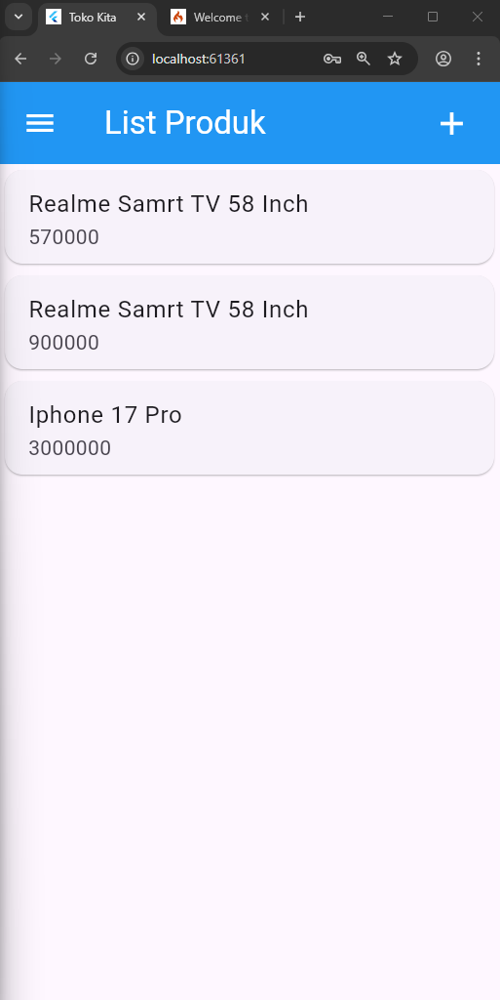

**Proses:**
- Data produk dihapus dari sistem
- User diarahkan kembali ke halaman list produk
- Produk yang dihapus tidak lagi muncul di list

### 8. Proses Logout

#### a. Menu Logout
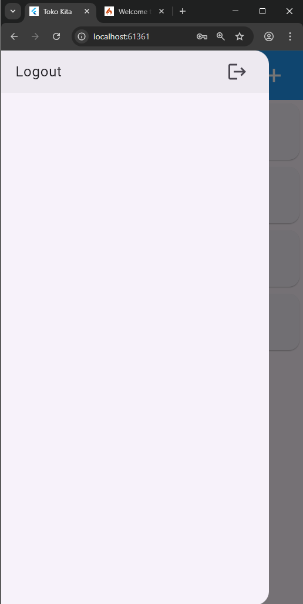

**Proses:**
- User mengklik hamburger menu di AppBar
- User memilih opsi "Logout"

**Kode Logout:**
```dart
ListTile(
  title: const Text('Logout'),
  trailing: const Icon(Icons.logout),
  onTap: () async {
    await LogoutBloc.logout().then(
      (value) => {
        Navigator.of(context).pushAndRemoveUntil(
          MaterialPageRoute(builder: (context) => LoginPage()),
          (route) => false,
        ),
      },
    );
  },
)
```
**Penjelasan:**
Menu logout ini ada di drawer samping. ListTile bikin tampilan menu yang rapi dengan icon logout di sebelah kanan. Ketika di-tap, LogoutBloc dipanggil untuk clear semua data session user. Setelah itu pushAndRemoveUntil digunakan untuk clear semua halaman dan balik ke halaman login. Parameter (route) => false artinya hapus semua halaman dari stack navigation.

## 🌐 Integrasi API & Backend

### Konfigurasi API Base URL
```dart
class ApiUrl {
  static const String baseUrl = 'http://localhost:8080';
  static const String registrasi = baseUrl + '/registrasi';
  static const String login = baseUrl + '/login';
  static const String listProduk = baseUrl + '/produk';
  static const String createProduk = baseUrl + '/produk';
  
  static String updateProduk(int id) {
    return baseUrl + '/produk/' + id.toString();
  }
  
  static String deleteProduk(int id) {
    return baseUrl + '/produk/' + id.toString();
  }
}
```
**Penjelasan:**
Konfigurasi API ini menentukan alamat server backend yang digunakan aplikasi. Base URL diset ke localhost port 8080, yang artinya aplikasi terhubung ke server lokal. Setiap endpoint API dibuat dengan menggabungkan base URL dengan path tertentu. Untuk operasi yang butuh ID seperti update dan delete, kita bikin fungsi yang menerima parameter ID dan mengembalikan URL yang lengkap.

### Helper Class API untuk HTTP Requests

#### Fungsi POST (Create Data)
```dart
Future<dynamic> post(dynamic url, dynamic data) async {
  var token = await UserInfo().getToken();
  var responseJson;
  try {
    final response = await http.post(
      Uri.parse(url),
      body: data,
      headers: {HttpHeaders.authorizationHeader: "Bearer $token"},
    );
    responseJson = _returnResponse(response);
  } on SocketException {
    throw FetchDataException('No Internet connection');
  }
  return responseJson;
}
```
**Penjelasan:**
Fungsi POST digunakan untuk mengirim data baru ke server, seperti saat registrasi atau tambah produk. Pertama kita ambil token dari storage lokal untuk otentikasi. Data dikirim dalam body request dengan header Authorization yang berisi Bearer token. Kalau tidak ada koneksi internet, akan muncul exception. Response dari server diproses oleh fungsi _returnResponse untuk handle berbagai status code.

#### Fungsi GET (Read Data)
```dart
Future<dynamic> get(dynamic url) async {
  var token = await UserInfo().getToken();
  var responseJson;
  try {
    final response = await http.get(
      Uri.parse(url),
      headers: {HttpHeaders.authorizationHeader: "Bearer $token"},
    );
    responseJson = _returnResponse(response);
  } on SocketException {
    throw FetchDataException('No Internet connection');
  }
  return responseJson;
}
```
**Penjelasan:**
Fungsi GET digunakan untuk mengambil data dari server, seperti list produk. Tidak ada body data yang dikirim, cuma URL dengan header Authorization saja. Token tetap diperlukan untuk memastikan user sudah login dan punya akses untuk ambil data.

#### Fungsi PUT (Update Data)
```dart
Future<dynamic> put(dynamic url, dynamic data) async {
  var token = await UserInfo().getToken();
  var responseJson;
  try {
    final response = await http.put(
      Uri.parse(url),
      body: data,
      headers: {
        HttpHeaders.authorizationHeader: "Bearer $token",
        HttpHeaders.contentTypeHeader: "application/json",
      },
    );
    responseJson = _returnResponse(response);
  } catch (error) {
    throw FetchDataException('No Internet connection');
  }
  return responseJson;
}
```
**Penjelasan:**
Fungsi PUT untuk update data existing, seperti edit produk. Selain Authorization header, kita juga set Content-Type jadi application/json karena data yang dikirim dalam format JSON. Body berisi data yang sudah di-encode JSON untuk update produk tertentu berdasarkan ID.

#### Fungsi DELETE (Hapus Data)
```dart
Future<dynamic> delete(dynamic url) async {
  var token = await UserInfo().getToken();
  var responseJson;
  try {
    final response = await http.delete(
      Uri.parse(url),
      headers: {HttpHeaders.authorizationHeader: "Bearer $token"},
    );
    responseJson = _returnResponse(response);
  } on SocketException {
    throw FetchDataException('No Internet connection');
  }
  return responseJson;
}
```
**Penjelasan:**
Fungsi DELETE untuk hapus data dari server. Mirip dengan GET, tidak ada body data, cuma URL dengan token authorization. URL sudah include ID produk yang mau dihapus di endpoint-nya.

### Response Handling
```dart
dynamic _returnResponse(http.Response response) {
  switch (response.statusCode) {
    case 200:
      return response;
    case 400:
      throw BadRequestException(response.body.toString());
    case 401:
    case 403:
      throw UnauthorisedException(response.body.toString());
    case 422:
      throw InvalidInputException(response.body.toString());
    case 500:
    default:
      throw FetchDataException(
        'Error occured while Communication with Server with StatusCode : ${response.statusCode}',
      );
  }
}
```
**Penjelasan:**
Fungsi ini handle berbagai response code dari server. Status 200 artinya sukses, langsung return response. Status 400 artinya bad request (parameter salah), 401/403 artinya tidak ada akses, 422 artinya input tidak valid, 500 artinya server error. Setiap error code punya exception sendiri supaya aplikasi bisa handle error dengan tepat.

### Penggunaan API di BLoC

#### Login API
```dart
class LoginBloc {
  static Future<Login> login({String? email, String? password}) async {
    String apiUrl = ApiUrl.login;
    var body = {"email": email, "password": password};
    var response = await Api().post(apiUrl, body);
    var jsonObj = json.decode(response.body);
    return Login.fromJson(jsonObj);
  }
}
```
**Penjelasan:**
LoginBloc menggunakan API POST untuk kirim email dan password ke server. Body request berisi data login dalam bentuk Map. Response dari server di-decode dari JSON jadi object Login menggunakan factory method fromJson. Kalau login berhasil, server akan return token yang bisa dipake untuk request selanjutnya.

#### Registrasi API
```dart
class RegistrasiBloc {
  static Future<Registrasi> registrasi({
    String? nama,
    String? email,
    String? password,
  }) async {
    String apiUrl = ApiUrl.registrasi;
    var body = {"nama": nama, "email": email, "password": password};
    var response = await Api().post(apiUrl, body);
    var jsonObj = json.decode(response.body);
    return Registrasi.fromJson(jsonObj);
  }
}
```
**Penjelasan:**
RegistrasiBloc juga pakai POST API untuk kirim data user baru. Body berisi nama, email, dan password. Server akan proses registrasi dan return status berhasil atau gagal dalam bentuk JSON yang dikonvert jadi object Registrasi.

#### Produk CRUD API
```dart
// GET - Ambil semua produk
static Future<List<Produk>> getProduks() async {
  String apiUrl = ApiUrl.listProduk;
  var response = await Api().get(apiUrl);
  var jsonObj = json.decode(response.body);
  List<dynamic> listProduk = (jsonObj as Map<String, dynamic>)['data'];
  List<Produk> produks = [];
  for (int i = 0; i < listProduk.length; i++) {
    produks.add(Produk.fromJson(listProduk[i]));
  }
  return produks;
}

// POST - Tambah produk baru
static Future addProduk({Produk? produk}) async {
  String apiUrl = ApiUrl.createProduk;
  var body = {
    "kode_produk": produk!.kodeProduk,
    "nama_produk": produk.namaProduk,
    "harga": produk.hargaProduk.toString(),
  };
  var response = await Api().post(apiUrl, body);
  var jsonObj = json.decode(response.body);
  return jsonObj['status'];
}

// PUT - Update produk
static Future updateProduk({required Produk produk}) async {
  String apiUrl = ApiUrl.updateProduk(int.parse(produk.id!));
  var body = {
    "kode_produk": produk.kodeProduk,
    "nama_produk": produk.namaProduk,
    "harga": produk.hargaProduk.toString(),
  };
  var response = await Api().put(apiUrl, jsonEncode(body));
  var jsonObj = json.decode(response.body);
  return jsonObj['status'];
}

// DELETE - Hapus produk
static Future<bool> deleteProduk({int? id}) async {
  String apiUrl = ApiUrl.deleteProduk(id!);
  var response = await Api().delete(apiUrl);
  var jsonObj = json.decode(response.body);
  return (jsonObj as Map<String, dynamic>)['data'];
}
```
**Penjelasan:**
ProdukBloc implementasi semua operasi CRUD dengan API. GET untuk ambil list produk dari server, response berupa array JSON yang dikonvert jadi List<Produk>. POST untuk tambah produk baru, data produk dikirim dalam body request. PUT untuk update produk existing, ID produk ada di URL sedangkan data baru ada di body. DELETE untuk hapus produk berdasarkan ID yang ada di URL. Semua response di-decode dari JSON dan return status operasi atau data yang diminta.

### Error Handling & Exception
```dart
// Custom Exceptions
class AppException implements Exception {
  final String _message;
  final String _prefix;
  AppException([this._message, this._prefix]);
  String toString() {
    return "$_prefix$_message";
  }
}

class FetchDataException extends AppException {
  FetchDataException([String? message]) : super(message, "Error During Communication: ");
}

class BadRequestException extends AppException {
  BadRequestException([message]) : super(message, "Invalid Request: ");
}

class UnauthorisedException extends AppException {
  UnauthorisedException([message]) : super(message, "Unauthorised: ");
}

class InvalidInputException extends AppException {
  InvalidInputException([String? message]) : super(message, "Invalid Input: ");
}
```
**Penjelasan:**
Aplikasi punya custom exception untuk handle berbagai jenis error dari API. FetchDataException untuk masalah koneksi atau komunikasi, BadRequestException untuk request yang salah format, UnauthorisedException untuk masalah autentikasi, InvalidInputException untuk data input yang tidak valid. Setiap exception punya message yang jelas supaya user tau apa masalahnya.

### Token Management
```dart
class UserInfo {
  Future<void> setToken(String value) async {
    final SharedPreferences pref = await SharedPreferences.getInstance();
    await pref.setString("token", value);
  }

  Future<String?> getToken() async {
    final SharedPreferences pref = await SharedPreferences.getInstance();
    return pref.getString("token");
  }
}
```
**Penjelasan:**
Token dari hasil login disimpan dalam SharedPreferences supaya user tidak perlu login ulang setiap buka aplikasi. Token ini digunakan di semua request API sebagai Bearer token dalam Authorization header. Kalau token expired atau invalid, server akan return status 401 dan user harus login ulang.

## 🏗️ Arsitektur Aplikasi

### Model Data
- **Produk**: Model dengan properti id, kodeProduk, namaProduk, hargaProduk
- **Login**: Model untuk response login
- **Registrasi**: Model untuk response registrasi

### BLoC Pattern
- **LoginBloc**: Menangani proses autentikasi
- **RegistrasiBloc**: Menangani proses registrasi
- **ProdukBloc**: Menangani CRUD operasi produk
- **LogoutBloc**: Menangani proses logout

### Helper Classes
- **UserInfo**: Mengelola penyimpanan data user (SharedPreferences)
- **Api**: Helper untuk HTTP requests
- **ApiUrl**: Konstanta URL endpoint API

### Widget Custom
- **WarningDialog**: Dialog untuk menampilkan pesan error
- **SuccessDialog**: Dialog untuk menampilkan pesan sukses